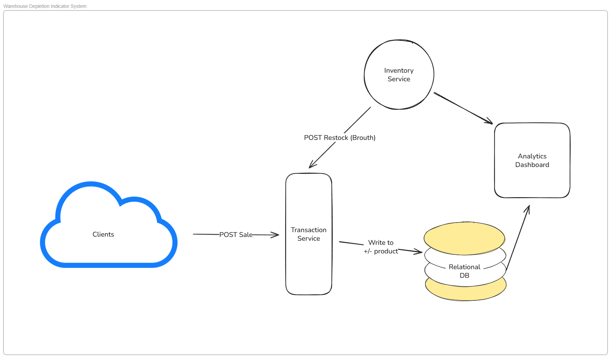

ABOUT
=====

System Design Document


ONLINE SHOP
-----------

A mid-sized e-commerce business with millions of customers struggles with inventory management - they're constantly dealing with stale stock and out-of-stocks because they can't react quickly to the high volume of daily transactions and customer purchase trends, or proactively forecast while trends are still emerging. Their analysts spend too much time gathering data from multiple systems instead of analyzing it. The business wants to solve these inventory issues by getting better visibility into customer purchase patterns.

Put together a high-level design for system(s) or dataset(s) that a data analyst or data scientist can easily work with. As a pilot problem, the business wants to know 'what inventory is most at risk of going out of stock in a week'. Focus less on particular ML models and more how you would architect the data flows.


Design product mid/large business.

100,000,000 products.

REQUIREMENTS
------------

Non-functional:
1. Millions of customers - transactions per hour/day/week? volume of stream of data?
2. Gathering data for analyst (what system used?) is slow, draws from multiple sources (which sources?)
3. Repository of data?

Functional:
1. About 10 million customers.
2. Each customer buys 5 items per day.
3. A dozen (~12) analysts will use the analytics system.
4. Interface with inventory system.

About 50 million sales per day.

API
---

```
POST /sale {
	customer id,
	product id,
	quantity,
	timestamp (Unix ts, UTC)
}
```

TIER I
------

Start with a simple low data volume system. 250 products, 100 customers, 50 sales per day.

The **Inventory Service** is a key/value store, keyed by product id. The data, amongst other things, includes current stock (quantity) of the product.

The **Transaction Service** ingests changes in inventory (sales or restocks) and writes to a RDB.

The RDB has a table storing the product inventory changes. Table (inventory_change) columns are:\

id,pid,type,quantity,timestamp

id			- serial id of change, pkey\
pid			- product id, indexed\
type		- sale/restock\
quantity	- amount of products sold/bought\
timestamp	- Unix date time

The **Analytics Dashboard** displays items that will deplete within a week.

1. Get changes for each product over the last 7 days (ts > now() - 604800 seconds).
2. Calculate the velocity by subtracting the restocks from the sales.
3. Get current inventory quantity from **Inventory Service** (by pid) and subtract the velocity from it.
4. If the result if equal to or less than 0 (or other threshold) then display it on the dashboard.

Analytics Dashboard can store values in-memory (Redis?) and have a scheduled job that refreshes all products each hour.



NOTES
-----

Speed			- How fast something is moving. Change of position over time.
Velocity		- How fast something is moving, direction of movement. The magnitude is speed, orientation relative to origin is direction. Origin usually is the object itself.
Acceleration	- The rate of change in velocity. In calc terms, the derivative of velocity.

Velocity of a product:
	- includes sold
	- includes restocks (bought)
	- sum of sold - restocks, per delta time
